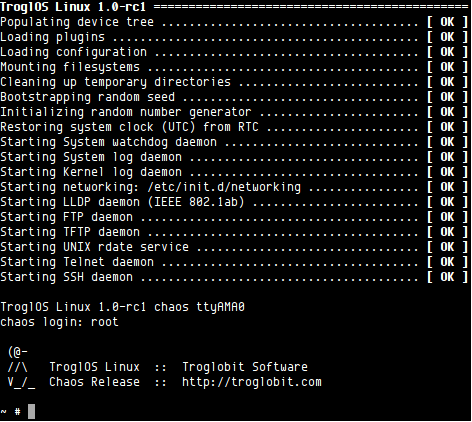

TroglOS Linux | Your Virtual Devboard
=====================================

Table of Contents
-----------------

* [Introduction](#introduction)
* [Requirements](#requirements)
* [Running](#running)
* [Upgrading Linux](#upgrading-linux)
* [Testing SNMP](#testing-snmp)
* [Dropbear SSH](#dropbear-ssh)
* [Using Telnet](#using-telnet)
* [Bugs & Feature Requests](#bugs--feature-requests)

Introduction
------------

TroglOS is a playful, but working, example of how to create a virtual
devboard, based on Linux and BusyBox.  Use it to test your embedded
applications before the actual hardware arrives.  Or as a reference when
said hardware starts acting up -- as it invariably does ...

Requirements
------------

The build environment requires at least the following tools, tested on
Ubuntu 14.04:

* gcc-arm-linux-gnueabi
* cpp-arm-linux-gnueabi
* binutils-arm-linux-gnueabi
* libc6-armel-cross
* libc6-dev-armel-cross
* curl
* make
* gcc (or clang, for the menuconfig interface)
* quilt
* qemu-system-arm
* (install libvirt-bin and virt-manager as well!)
* probably more, gzip?, mkimge?

Running
-------

TroglOS uses Qemu to run the resulting kernel + image.  For networking
you may need to do the following to your host system:

    sudo chmod 4755 /usr/lib/qemu-bridge-helper
    sudo dpkg-statoverride --add root root 4755 /usr/lib/qemu-bridge-helper

The first command makes the Qemu helper "suid root", which means we're
allowed to manipulate the network to gain external network access.  The
last command is for Debian/Ubuntu system, it makes sure to record your
change so that any Qemu package upgrades will overwrite our mode change.

Now you need to tell Qemu what bridges in the system you are allowed to
connect to, edit/create the file `/etc/qemu/bridge.conf` and add:

    allow virbr0

Assuming you have a `virbr0` interface in your system.  If you've run
anything in [virt-manager](http://virt-manager.org/) prior to this then
you're set, otherwise you're unfortunately on your own.

Clone this repository, then type `make`.  When the build has completed,
start Qemu with `make run` -- Have fun!

Upgrading Linux
---------------

Change the `KERNEL_VERSION` in the top-level `Makefile`.  If the kernel
is just a minor patch release, you're done.

If it's a major kernel upgrade, copy the latest `kernel/config-X.YY` to
`kernel/config-X.ZZ` and call `make kernel_oldconfig`.  This will unpack
the kernel and give you a set of questions for all new features.

Make sure to do a `make kernel_saveconfig`, and possibly add the new
`kernel/config-X.ZZ` to GIT.

Testing SNMP
------------

TroglOS uses [Robert Ernst's](http://members.aon.at/linuxfreak)
[mini_snmpd](http://members.aon.at/linuxfreak/linux/mini_snmpd.html) as
its SNMP daemon currently.  It's extremely small and therefore very
limited in its functionality, but it's enough to monitor TroglOS by
remote if needed.

To test it you need an SNMP client.  The following command installs
`snmpset`, `snmpget`, `snmpwalk`, base MIBs and all standard MIBs
needed.  You may also be interested in a more graphical alternative,
[snmpB](http://sourceforge.net/projects/snmpb/)

<kbd>$ sudo apt-get install snmp libsnmp-base snmp-mibs-downloader</kbd>

When done you should be able to do the following:

<kbd>$ snmpwalk -v2c -c public 192.0.2.42</kbd>

    SNMPv2-MIB::sysDescr.0 = STRING: TroglOS Linux Virtual Devboard
    SNMPv2-MIB::sysObjectID.0 = OID: SNMPv2-SMI::enterprises
    SNMPv2-MIB::sysUpTime.0 = Timeticks: (465) 0:00:04.65
    SNMPv2-MIB::sysContact.0 = STRING: troglobit@gmail.com
    SNMPv2-MIB::sysName.0 = STRING: chaos
    SNMPv2-MIB::sysLocation.0 = STRING: GitHub
    IF-MIB::ifNumber.0 = INTEGER: 1
    IF-MIB::ifIndex.1 = INTEGER: 1
    IF-MIB::ifDescr.1 = STRING: eth0
    IF-MIB::ifOperStatus.1 = INTEGER: up(1)
    IF-MIB::ifInOctets.1 = Counter32: 5557
    IF-MIB::ifInUcastPkts.1 = Counter32: 45
    IF-MIB::ifInDiscards.1 = Counter32: 0
    IF-MIB::ifInErrors.1 = Counter32: 0
    IF-MIB::ifOutOctets.1 = Counter32: 2958
    IF-MIB::ifOutUcastPkts.1 = Counter32: 19
    IF-MIB::ifOutDiscards.1 = Counter32: 0
    IF-MIB::ifOutErrors.1 = Counter32: 0
    SNMPv2-SMI::mib-2.25.1.1.0 = Timeticks: (71983) 0:11:59.83
    
<kbd>$ snmpget -c public -v 2c 192.0.2.42 system.sysUpTime.0</kbd>

    SNMPv2-MIB::sysUpTime.0 = Timeticks: (2344) 0:00:23.44

Dropbear SSH
------------

The most common embedded SSH daemon in use on embedded Linux systems
today is [Dropbear](https://matt.ucc.asn.au/dropbear/dropbear.html) by
the incredibly humble [Matt Johnston](https://matt.ucc.asn.au/).

Dropbear is started by default in TroglOS.  It currently allows `root`
access, but we recommend disabling this and instead setting up another
user: <kbd>adduser example</kbd>

Test SSH from your host simply by: <kbd>ssh example@192.0.2.42</kbd>

Using Telnet
------------

Currently `telnetd` is started by default in TroglOS, this will change
in the future, but it will still be available.

Test it from your host by simply calling <kbd>telnet 192.0.2.42</kbd>

Bugs & Feature Requests
-----------------------

Feel free to report bugs and request features, or even submit your own
[pull requests](https://help.github.com/articles/using-pull-requests/)
using [GitHub](https://github.com/troglobit/troglos)

Cheers!  
-- Joachim
